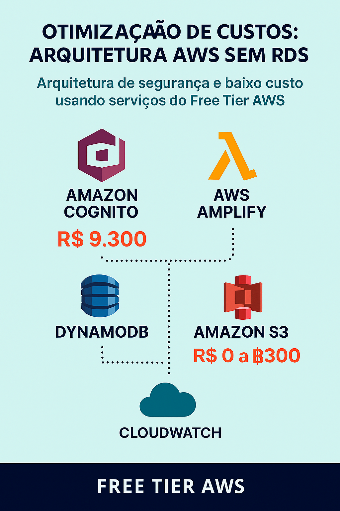
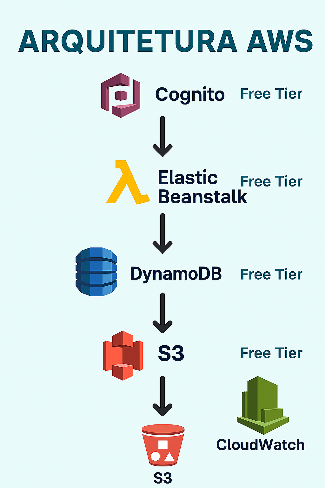

# Abstergo_Industries

## 🚀 RELATÓRIO DE IMPLEMENTAÇÃO DE SERVIÇOS AWS

📅 **Data:** 17/12/2025  
🏢 **Empresa:** Abstergo Industries  
👨‍💼 **Responsável:** Pedro Zeferino da Silva

---

## 🌟 Introdução

Este relatório apresenta o processo de implementação de uma arquitetura **100% Serverless** na empresa **Abstergo Industries** com mais de 03 ferramentas na AWS, realizado por **Pedro Zeferino da Silva**.  
O objetivo foi utilizar **serviços gratuitos da AWS (Free Tier)** para construir uma base tecnológica moderna, segura e com custos dramaticamente reduzidos.

A estratégia cobre:

✅ **Autenticação Segura:** Gerenciamento de usuários com Amazon Cognito.  
✅ **Segurança e Permissões:** Controle de acesso granular com AWS IAM.  
✅ **Banco de Dados NoSQL:** Performance e escalabilidade com Amazon DynamoDB.  
✅ **Backend Serverless:** Execução de código sob demanda com AWS Lambda.  
✅ **APIs Gerenciadas:** Criação e exposição de APIs com Amazon API Gateway.  
✅ **Armazenamento de Objetos:** Storage seguro e durável com Amazon S3.  
✅ **Monitoramento e Alertas de Custo:** Controle total com Amazon CloudWatch e AWS Budgets.

O resultado é uma solução **sem custos iniciais**, que escala sob demanda e elimina a necessidade de gerenciar servidores.

---

## 🛠️ Descrição do Projeto

O projeto foi dividido em **8 etapas essenciais, com 3 passos recomendados para a evolução do sistema.**

---

## 🔐 Etapa 1 — Amazon Cognito

**Foco:** Autenticação e gerenciamento de usuários.  
**Por que usar?** Solução gerenciada que oferece cadastro, login, recuperação de senha e integração social, com um generoso Free Tier.

### ✅ Caso de uso

- Cadastro e login de usuários via e-mail, CPF ou telefone.
- Políticas de senha e verificação de e-mail automáticas.
- **Login Social:** Opcional para login com Google, Facebook, etc., aumentando a conversão.
- **Interface Pronta (Hosted UI):** O Cognito pode fornecer telas prontas para login, "esqueci a senha" e confirmação de cadastro, economizando tempo de desenvolvimento.
- **Segurança de API com JWT:** Após o login, gera um Token (JWT) que é enviado a cada requisição para o back-end, garantindo que o usuário é quem diz ser.

### 🧭 Passo a passo - AWS Cognito

1. **Console AWS → Amazon Cognito.**
2. Clique em **"Create user pool"**.
3. Escolha os provedores de identidade (ex: E-mail).
4. Configure as políticas de senha e MFA (opcional).
5. Crie um **"App client"** para sua aplicação.
6. Integre o App client ID e o User Pool ID no seu front-end.
7. Teste o fluxo de cadastro e login.

---

## 🛡️ Etapa 2 — AWS IAM (Identity and Access Management)

**Foco:** Segurança e controle de permissões.  
**Por que usar?** É a base da segurança na AWS. Permite que cada serviço acesse apenas o que é estritamente necessário (Princípio do Menor Privilégio), evitando acessos indevidos e custos acidentais.

### ✅ Caso de uso - AWS IAM

- Criar "Roles" (funções) para que serviços AWS (como Lambda) possam interagir entre si.
- Criar usuários para desenvolvedores com permissões limitadas, em vez de usar a conta root.

### 🧭 Passo a passo - AWS IAM

1. **Console AWS → IAM.**
2. **Roles → Create role.**
3. Selecione o caso de uso (ex: **AWS service → Lambda**).
4. Anexe as políticas de permissão necessárias (ex: `AWSLambdaBasicExecutionRole` para logs e uma política para acesso ao DynamoDB).
5. Nomeie a Role e finalize.
6. Use esta Role ao criar suas funções Lambda.

---

## 🗂️ Etapa 3 — Amazon DynamoDB

**Foco:** Banco de dados NoSQL rápido, flexível e escalável.  
**Por que é barato?** O Free Tier inclui 25 GB de armazenamento e 25 unidades de capacidade de leitura/escrita, suficiente para muitas aplicações em estágio inicial. O modelo é pay-as-you-go, sem custo quando ocioso.

### ✅ Caso de uso — DynamoDB

- Armazenar dados de usuários, logs, informações de produtos, etc.
- Respostas em milissegundos de um dígito.

### 🧭 Passo a passo - AWS DynamoDB

1. **Console AWS → DynamoDB.**
2. **Create table.**
3. Defina um nome para a tabela (ex: `usuarios`).
4. Defina a **Partition key** (chave de partição), como `userId`.
5. Deixe as configurações no modo **On-demand** (sob demanda) para pagar apenas pelo que usar.
6. Crie a tabela e comece a usá-la a partir do Lambda.

---

## 🧠 Etapa 4 — AWS Lambda

**Foco:** Executar código sem provisionar ou gerenciar servidores (Backend Serverless).  
**Por que é barato?** Você paga apenas pelo tempo de execução do código, em incrementos de milissegundos. O Free Tier inclui **1 milhão de execuções gratuitas por mês**.

### ✅ Caso de uso — Lambda

- Funções para criar, ler, atualizar e deletar (CRUD) itens no DynamoDB.
- Processar uploads de arquivos do S3.
- Executar lógica de negócio acionada por uma API.

### 🧭 Passo a passo - AWS Lambda

1. **Console AWS → Lambda.**
2. **Create function.**
3. Selecione **"Author from scratch"**.
4. Escolha a linguagem (Node.js, Python, etc.).
5. Em **Permissions**, associe a **Role do IAM** criada na Etapa 2.
6. Escreva o código da sua função (ex: para salvar um item no DynamoDB).
7. Faça o deploy e teste a função.

---

## 🌐 Etapa 5 — Amazon API Gateway

**Foco:** Criar, publicar e gerenciar APIs.  
**Por que é barato?** Funciona como a "porta de entrada" para suas funções Lambda. O Free Tier inclui **1 milhão de chamadas de API por mês**.

### ✅ Caso de uso — API Gateway

- Expor as funções Lambda como endpoints de uma API REST (ex: `POST /users`, `GET /users/{id}`).
- **Validação de Token JWT:** Integrar-se nativamente com o Cognito para validar o token do usuário em cada requisição, bloqueando acessos não autorizados antes mesmo de chegarem ao Lambda.
- Controlar throttling (limitação de requisições) e cache.

### 🧭 Passo a passo

1. **Console AWS → API Gateway.**
2. Escolha **"REST API" → Build.**
3. Crie uma nova API (ex: `AbstergoAPI`).
4. Em **Actions**, crie recursos (ex: `/users`) e métodos (ex: `POST`, `GET`).
5. Para cada método, configure a **Integration type** como **"Lambda Function"** e selecione a função Lambda correspondente.
6. Faça o **Deploy** da API para um "stage" (estágio), como `v1`.
7. Você receberá uma URL para invocar sua API.

---

## 📦 Etapa 6 — Amazon S3

**Foco:** Armazenamento seguro e escalável de objetos.  
**Por que é barato?** O Free Tier inclui 5 GB de armazenamento. É ideal para armazenar arquivos de mídia, documentos e backups com alta durabilidade.

### ✅ Caso de uso — S3

- Armazenar imagens de perfil de usuários, documentos PDF, etc.
- Hospedar um site estático (front-end React, Angular, etc.).
- Gatilho (trigger) para funções Lambda quando um novo objeto é carregado.

### 🧭 Passo a passo - AWS S3

1. **Console AWS → S3.**
2. **Create bucket** (o nome deve ser globalmente único).
3. **Bloqueie todo o acesso público** por padrão.
4. Ative a criptografia (SSE-S3).
5. Use URLs pré-assinadas (geradas pelo Lambda) para permitir que usuários façam upload/download de forma segura.

---

## ⚡ Etapa 7 — Amazon CloudFront (CDN)

**Foco:** Acelerar a entrega do site e aumentar a segurança.  
**Por que é barato?** O Free Tier é imenso (1 TB de transferência de dados/mês). Um site lento perde vendas, e o CloudFront resolve isso a custo praticamente zero para começar.

### ✅ Caso de uso — CloudFront

- **Site Rápido:** Coloca cópias do seu site (hospedado no S3) em servidores espalhados pelo Brasil e pelo mundo, diminuindo a latência para o cliente final.
- **Segurança:** Funciona como uma primeira camada de defesa, protegendo sua aplicação contra ataques DDoS básicos.
- **Economia:** A transferência de dados entre o CloudFront e o S3 é gratuita, e o custo de transferência para o usuário é mais baixo via CDN.

### 🧭 Passo a passo - AWS CloudFront

1. **Console AWS → CloudFront.**
2. **Create a CloudFront distribution.**
3. No campo **"Origin domain"**, selecione o bucket S3 onde seu site está hospedado.
4. Em **"Viewer"**, configure para redirecionar HTTP para HTTPS.
5. Mantenha as outras configurações padrão para começar.
6. Após o deploy, use a URL da distribuição do CloudFront para acessar seu site.

---

## 📈 Etapa 8 — Monitoramento e Controle de Custos

**Foco:** Garantir que os custos permaneçam baixos e previsíveis.  
**Por que usar?** São ferramentas **gratuitas** que te dão visibilidade e controle sobre seus gastos, evitando surpresas.

### ✅ Caso de uso — CloudWatch e AWS Budgets

- **CloudWatch:** Monitorar métricas de serviços (invocações do Lambda, leituras do DynamoDB) e criar alarmes.
- **AWS Budgets:** Criar um orçamento (ex: $1) e receber um **alerta por e-mail** se a previsão de gastos exceder esse valor. **Esta é a etapa mais importante para o controle de custos.**

### 🧭 Passo a passo — AWS Budgets

1. **Console AWS → AWS Budgets.**
2. **Create budget.**
3. Selecione **"Cost budget"**.
4. Defina um período (ex: Monthly) e um valor (ex: `1` USD).
5. Configure um **"Alert threshold"** em 80% ou 90% do seu orçamento.
6. Adicione seu e-mail para receber a notificação.
7. Finalize a criação.

---

## 🚀 Próximos Passos e Melhorias

As 7 etapas acima formam a base de uma aplicação serverless robusta e econômica. Para evoluir o projeto, torná-lo mais profissional e automatizado, os próximos passos são:

### 📄 Infraestrutura como Código (IaC)

- **O que é?** Em vez de clicar no console da AWS, você descreve toda a sua arquitetura (Lambdas, DynamoDB, etc.) em arquivos de texto (YAML ou TypeScript).

- **Ferramentas:** **AWS SAM (Serverless Application Model)** ou **AWS CDK (Cloud Development Kit)**.

- **Por que usar?**

  - **Automação:** Recrie todo o ambiente em minutos.

  - **Consistência:** Garante que os ambientes de desenvolvimento e produção sejam idênticos.

  - **Versionamento:** Trate sua infraestrutura como código, versionando-a com Git.

### 🔄 Automação de Deploy (CI/CD)

- **O que é?** Um pipeline que automaticamente testa e implanta seu código na AWS toda vez que você envia uma alteração para o seu repositório Git (ex: GitHub, AWS CodeCommit).

- **Ferramentas:** **AWS CodePipeline**, **AWS CodeBuild** e **AWS CodeDeploy**.

- **Por que usar?**

  - **Velocidade:** Entregue novas funcionalidades aos seus usuários mais rápido.

  - **Segurança:** Reduz o risco de erro humano durante o deploy manual.

  - **Qualidade:** Automatize testes para garantir que bugs não cheguem à produção.

### ✉️ Mensageria e Sistemas Assíncronos

- **O que é?** Em vez de uma API executar uma tarefa pesada diretamente (e fazer o usuário esperar), ela publica um "evento" que é processado em segundo plano.

- **Ferramentas:** **Amazon SQS (Simple Queue Service)** para filas e **Amazon SNS (Simple Notification Service)** para notificações.

- **Exemplo Prático:** Quando um cliente compra um remédio, o Lambda finaliza o pedido e simplesmente publica uma notificação no SNS. Outros serviços, inscritos neste tópico, podem então agir em paralelo: um envia o e-mail de confirmação ("Seu pedido foi aprovado!"), outro avisa o sistema de logística ("O motoboy saiu para entrega"), e um terceiro atualiza o painel de métricas.

- **Por que usar?**

  - **Resiliência:** Se o serviço de e-mail falhar, isso não impede que o sistema de logística seja avisado.

  - **Performance:** A API responde instantaneamente ao usuário, pois o trabalho pesado acontece nos bastidores.

  - **Escalabilidade:** Permite que picos de solicitações sejam enfileirados e processados de forma controlada.

---

## 💰 Comparativo de Custos — Antes vs Depois da Nuvem

### 📉 Antes da Nuvem (Infra Local)

| Categoria              | Custo Mensal   |
| ---------------------- | -------------- |
| Servidores e Licenças  | R$ 2.000       |
| Manutenção e Energia   | R$ 2.300       |
| Equipe de TI           | R$ 6.000       |
| **Custo Mensal Total** | **~R$ 10.300** |

### 📈 Depois da Nuvem (AWS Serverless)

| Categoria                   | Custo Mensal (Dentro do Free Tier) |
| --------------------------- | ---------------------------------- |
| Infraestrutura (Serverless) | ✅ Grátis                          |
| Cognito                     | ✅ Grátis                          |
| DynamoDB                    | ✅ Grátis                          |
| Lambda                      | ✅ Grátis                          |
| IAM                         | ✅ Grátis                          |
| API Gateway                 | ✅ Grátis                          |
| S3                          | ✅ Grátis                          |
| CloudWatch & Budgets        | ✅ Grátis                          |
| Equipe de TI (Reduzida)     | R$ 3.000                           |
| **Custo Mensal Total**      | **~R$ 3.000**                      |

### 💡 Exemplo Prático: Custo para 1.000 Pedidos em uma Farmácia

Neste modelo, utilizamos o Nível Gratuito (Free Tier) e o modelo "Pay-as-you-go". Você não paga por servidores ociosos, apenas por eventos (cliques, leituras no banco).

| Ferramenta AWS          | Uso Estimado (Cenário 1k pedidos)         | Limite Gratuito (Free Tier)        | Custo Mensal (R$)  |
| ----------------------- | ----------------------------------------- | ---------------------------------- | ------------------ |
| AWS Lambda (Computação) | ~20.000 invocações (navegação + compra)   | 1.000.000 de invocações/mês        | R$ 0,00            |
| Amazon S3 (Site/Front)  | 2 GB de armazenamento + transferência     | 5 GB de armazenamento (12 meses)   | R$ 0,00            |
| DynamoDB (Banco)        | Leitura/Escrita dos pedidos e produtos    | 25 GB de armazenamento + 200M reqs | R$ 0,00            |
| Amazon Cognito (Login)  | 2.000 usuários ativos                     | 50.000 usuários ativos/mês         | R$ 0,00            |
| CloudFront (CDN)        | Transferência de dados do site            | 1 TB de transferência/mês          | R$ 0,00            |
| Elastic Beanstalk       | Implantação automática aplicações web     | Instância EC2 (Free Tier)          | R$ 0,00 750h/mês   |
| Route 53 (DNS)          | Gerenciamento do domínio (Custo fixo AWS) | Não possui free tier para zona     | R$ 2,50            |
| **CUSTO TOTAL**         | **Custo Variável**                        |                                    | **~R$ 2,50 / mês** |

_Se a farmácia não vender nada, o custo é praticamente zero. Se vender muito, o custo sobe linearmente, mas sempre proporcional ao lucro._

---

## 📊 Escalabilidade para crescer (Pay-as-you-go)

| Serviço AWS   | Free Tier (Mensal) | Custo Após o Limite (Aproximado) |
| ------------- | ------------------ | -------------------------------- |
| Cognito       | 50.000 MAUs        | US$ 0,0055 / MAU                 |
| DynamoDB      | 25 GB              | US$ 0,25 / GB                    |
| Lambda        | 1 milhão de exec.  | US$ 0,20 / milhão de exec.       |
| API Gateway   | 1 milhão de cham.  | US$ 1,00 / milhão de cham.       |
| S3 (Standard) | 5 GB               | US$ 0,023 / GB                   |
| CloudWatch    | 10 alarmes         | US$ 0,10 / alarme                |

---

---

## ✅ Conclusão

A adoção de uma arquitetura **100% Serverless** na AWS oferece uma transformação radical em relação ao modelo tradicional:

✅ **Custo Quase Zero para Começar:** A aplicação não custa nada se não tiver usuários.  
✅ **Escalabilidade Infinita e Automática:** Do primeiro ao milionésimo usuário, a infraestrutura se ajusta sem intervenção.  
✅ **Segurança Robusta:** Com IAM e serviços gerenciados, a base de segurança é sólida.  
✅ **Zero Gestão de Servidores:** Fim da preocupação com atualizações, patches ou sistemas operacionais.  
✅ **Foco no Produto:** A equipe de desenvolvimento pode se concentrar em criar valor para o negócio, não em manter a infraestrutura.

Esta é a abordagem mais moderna e financeiramente inteligente para empresas que buscam crescimento ágil e sustentável.

---

## 🔗 Anexos — Links Oficiais da AWS

🔗 **[AWS Free Tier](https://aws.amazon.com/pt/free/)**

🔗 **[Amazon Cognito](https://aws.amazon.com/cognito/)**

🔗 **[AWS IAM](https://aws.amazon.com/iam/)**

🔗 **[Amazon DynamoDB](https://aws.amazon.com/dynamodb/)**

🔗 **[AWS Lambda](https://aws.amazon.com/lambda/)**

🔗 **[Amazon API Gateway](https://aws.amazon.com/api-gateway/)**

🔗 **[Amazon S3](https://aws.amazon.com/s3/)**

🔗 **[Amazon Elastic Beanstalk](https://aws.amazon.com/pt/elasticbeanstalk/)**

🔗 **[Amazon CloudWatch](https://aws.amazon.com/cloudwatch/)**

🔗 **[AWS Budgets](https://aws.amazon.com/aws-cost-management/aws-budgets/)**

---

✍️ **Assinatura do Responsável pelo Projeto:**  
👨‍💼
📅 **Data Final:** 18/12/2025
